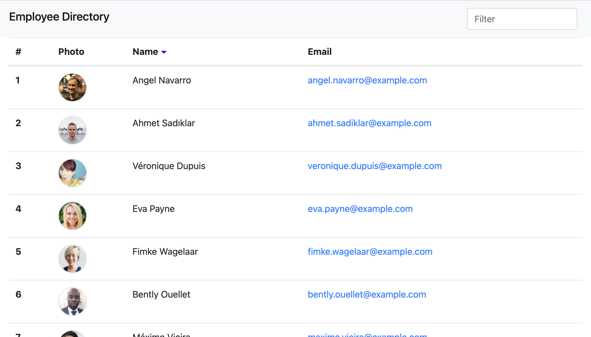

# Employee Directory
An employee directory built in React that allows both sorting and filtering of the employees by name.

## Uses

JS/Axios/React

-----------

## Installation Instructions

```
npm install
```

-----------

## Usagage Information

```
npm start
```

-----------

## Live Demo

https://erickmeline.github.io/Employee-Directory/

-----------

## Screen shot


-----------

## Code example
```
export default {
  getUsers: function() {
    return axios.get('https://randomuser.me/api/?results=15').then((res) => {
    const users = res.data.results;
    const results = users.map((user) => {
      return {
        name: user.name.first + ' ' + user.name.last,
        email: user.email,
        image: user.picture.thumbnail
      };
    });
    return results;
    }).catch((err) => console.log(err));
  }
};
```

-----------

## Questions
Reach out with additional questions:

[https://github.com/erickmeline](https://github.com/erickmeline) - [erickmeline@gmail.com](mailto://erickmeline@gmail.com)
